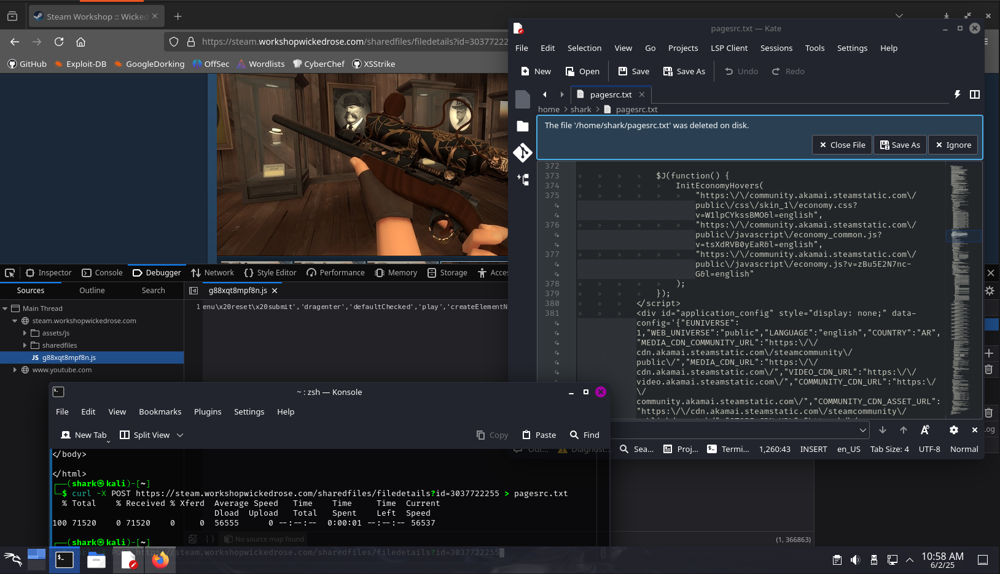

## Steam Personalized Phishing attemps

All of us have hobbys and interests. Some of us are into volleyball, music or gaming. I am playing my favorite game once a while - Team Fortress 2.  
This means that I have a lot of friends on Steam who share my interest, and their profiles talk about it. Very often there are situations where players have each other on their friends list without any interaction.  
### It was a regular day until...
That's why it was such a strange occurrence to be asked for help, to vote for an item on Steam Workshop.   Steam Workshop is a Valve-verified site that does not need to be accessed through a separate domain. I received the link https://steam.workshopwickedrose.com/sharedfiles/filedetails?id=3037722255. I'm paranoid about the links I receive, and this one was suspicious in itself, since the real link to Steam Workshop looks like this: https://steamcommunity.com/workshop/. The source of the site seemed to fantastically play off the real Steam site, but with one major difference. The login information is not sent to the steampowered.com server, but to a makeshift server marked with a strange address.   And a poorly camouflaged JS file called g88xqt8mpf8n.js had a perfect script in it to capture all the input data of a given form.  

#### Tools Used: 
- cURL
- OWASP TOP 10 based analysis

The scammer received the following screenshot with the comment "nice try, now my turn"

  
I got removed and blocked instantly.  

People constantly fall into such traps, even though verified AI models can even “take a look”, verify such a domain and advise the user whether to interact with it or not. Regardless, this site seems reliable for the first sight, the mentioned "skins for weapons" actually existed, had screenshots and even YouTube showcase video. AI can still figure it out immediately. Use this tools if you are not an expert/not sure about some things.

I always run a scan of the pages before engaging in any interaction. 
 
