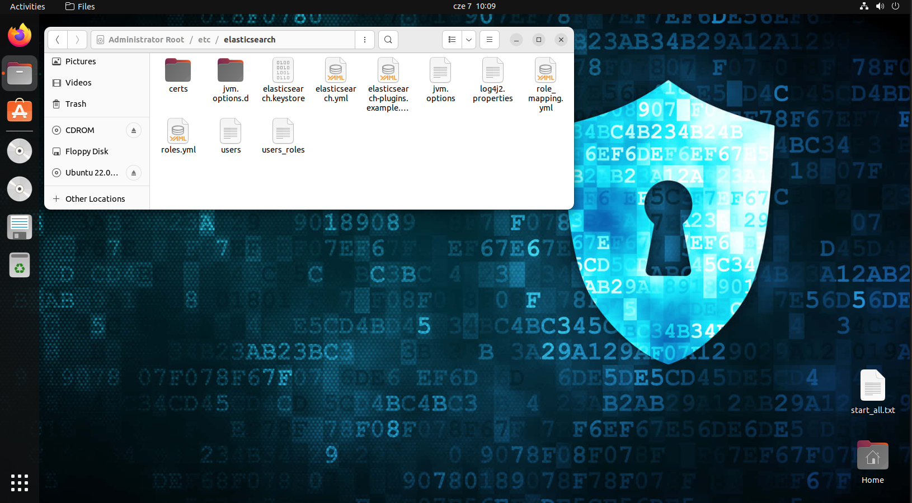
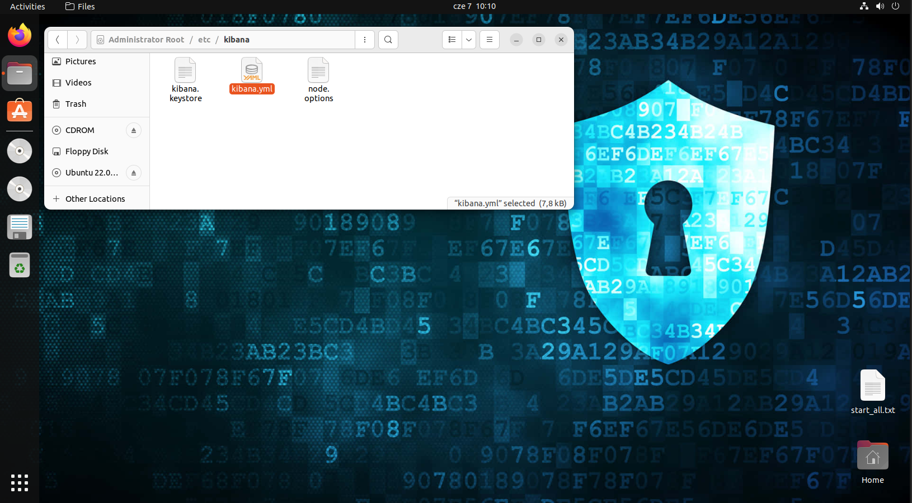
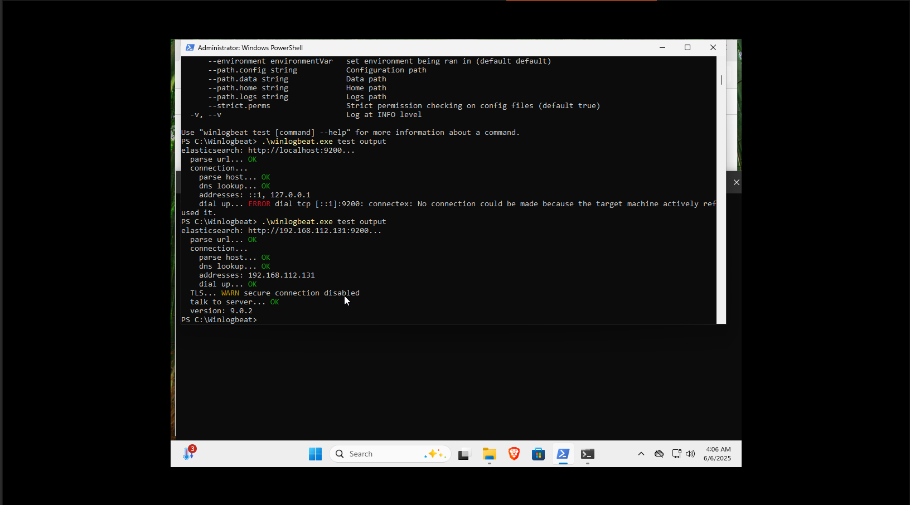
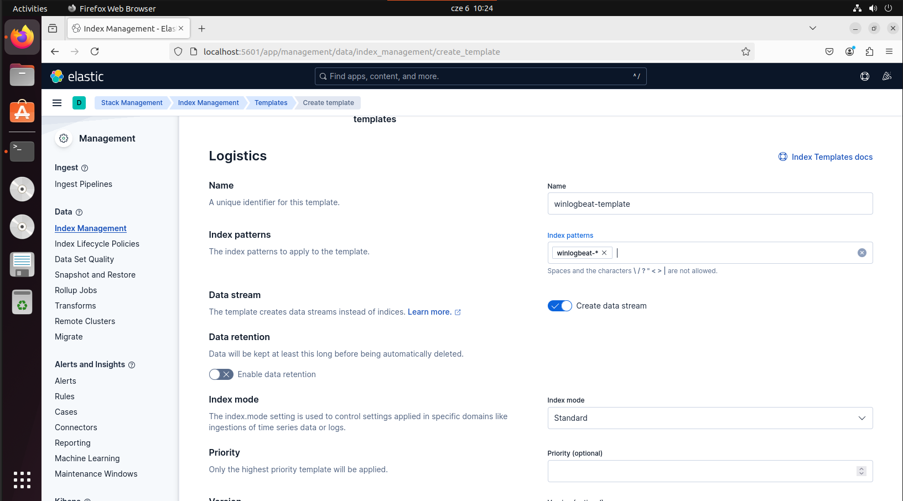
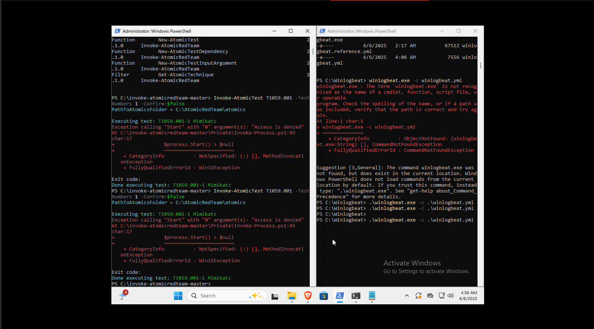
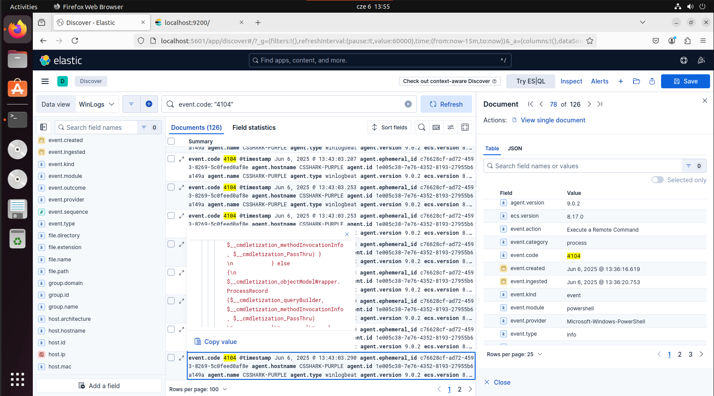
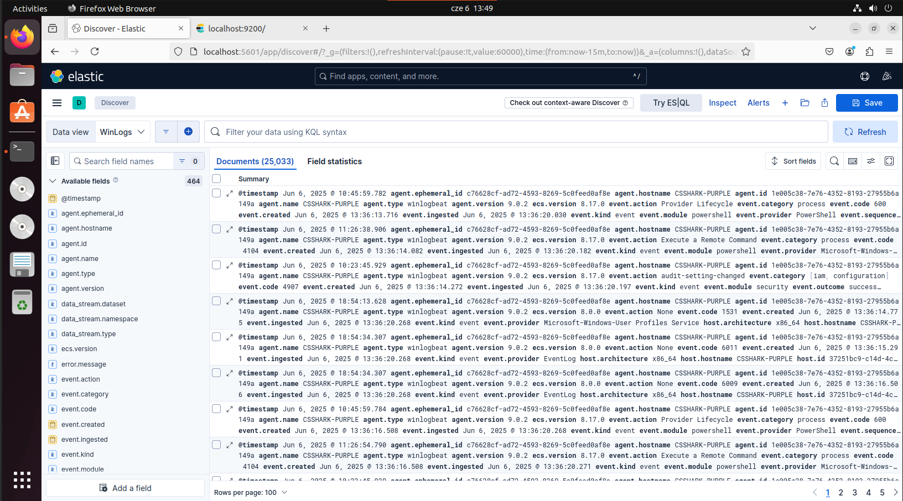

# SIEM + AtomicRedTeam Attacks Integration Test 

*This experiment was peformed by me on 06.06.2025*

Challenges of the experiment:

<ul>
  <li>Configure SIEM (in this case it was ELK Stack, open source SIEM)</li>
  <li>Install and configure winlogbeat</li>
  <li>Set up indexes for winlogbeat in Kibana</li> 
  <li>Use AtomicRedTeam to test if SIEM collects the correct data and find malicious events</li>
  <li>Detect events</li>
</ul>

Virtual Machines:
- Ubuntu 22.04.05 LTS VM  
- Microsoft Windows 11 x64 VM

### 1. ELK (Elasticsearch, Logstash, Kibana) - Open source configurable SIEM
ELK Stack is set of open-source products managed by Elastic company.  
**Elasticsearch** is a powerful engine for full-text search and data analysis, built on top of the open-source Apache Lucene project.  
**Logstash** acts as a log processing pipeline — it gathers data from multiple input sources, applies filtering or transformation, and then sends it to a supported destination like Elasticsearch. However, many modern ELK stack setups skip Logstash entirely, opting instead for lighter tools such as Fluentd, which also supports log collection and forwarding to Elasticsearch.  
**Kibana** provides the visualization layer — it lets users explore, analyze, and display data stored in Elasticsearch through an intuitive interface.  
Lastly, **Beats** are lightweight agents installed on edge systems that collect specific types of data and forward it to the rest of the stack. In this case I am going to set up winlogbeat from this category.  

Course of the exercise:  
  
Visited <a href="https://www.elastic.co/docs">Elasticsearch</a> documentation to deploy it locally on my Ubuntu VM. Installation process takes a few commands to execute:   
Importing the key of repository 
<pre><code>wget -qO - https://artifacts.elastic.co/GPG-KEY-elasticsearch | sudo gpg --dearmor -o /usr/share/keyrings/elasticsearch-keyring.gpg
</code></pre>  
Saving repository definition
<pre><code>echo "deb [signed-by=/usr/share/keyrings/elasticsearch-keyring.gpg] https://artifacts.elastic.co/packages/9.x/apt stable main" | sudo tee /etc/apt/sources.list.d/elastic-9.x.list</code></pre>  
Finally, installing packages:
<pre><code>sudo apt-get update && sudo apt-get install elasticsearch</code></pre>  
<pre><code>sudo apt-get update && sudo apt-get install logstash</code></pre>  
Kibana has a little different method:
<pre><code>curl -O https://artifacts.elastic.co/downloads/kibana/kibana-9.0.0-linux-x86_64.tar.gz  
curl https://artifacts.elastic.co/downloads/kibana/kibana-9.0.0-linux-x86_64.tar.gz.sha512 | shasum -a 512 -c -  
tar -xzf kibana-9.0.0-linux-x86_64.tar.gz  
cd kibana-9.0.0/</code></pre>

#### ELK Stack Configuration: 
Before running services and expecting them to work perfectly, there is need to configure some of the files. The first one we are looking for is ***elasticsearch.yml***.  
  
- User must ensure to make Elasticsearch visible in network, to do so the variable **network.host** must be changed to *0.0.0.0*  
- Lists of hosts to perform discovery is set by default to ["127.0.0.1", "[::1]"] this should not conflict but during troubleshooting I changed this value to *["127.0.0.1"]*  
- Disable **xpack.security** ! it disallows connecting for some reason and will cause a lot of problems when trying to connect to the localhost port.  
- You can compare your configuration to my configfiles attached to this directory (<a href="elasticsearch.yml">elastic</a> and <a href="kibana.yml">kibana</a>).

The second file to check is ***kibana.yml***.  
 
In this case we need to check two key variables:  
- **server.host** must be set to *"0.0.0.0"*
- **elasticsearch.hosts must be set to *["http://localhost:9200"]* (don't forget about *http* otherwise configfile will not switch to proper protocol and you won't be able to connect)

### 2. Installing Winlogbeat
Winlogbeat is agent that is installed on Windows host that is used to collect system logs and is integrated with Logstash. It allows to analyze logs in real-time using our ELK Stack SIEM.  
#### PowerShell
During installation user will have to deal with pws (a lot). I have discovered that Windows 11 ExecutionPolicy is highly restricted due security reasons. **Before installing anything via PowerShell**: <pre><code>powershell -ExecutionPolicy Bypass</code></pre>  
This command allows user to bypass weird security policies (even changing them as a root doesn't change anything, the system is going to ask for digital sign) totally. Followed 4 steps from <a href="https://www.elastic.co/downloads/beats/winlogbeat">documentation</a> and run service using command only from the link I provided.
#### Configuration
The only variable the user had to check was **output.elasticsearch: hosts** (and uncomment if commented by default) in ***winlogbeat.yml*** file. Here user needs to enter IPv4 of ELK Stack Virtual Machine (not *localhost* !).  
Proper format of variable: **hosts: ["http://192.168.112.131:9200"] (do not forget about *http* again).  
I check also if configfile has all needed winlogbeat event logs:  
<pre><code>- name: Application  
ignore_older: 72h  

- name: System  

- name: Security  

- name: Microsoft-Windows-Sysmon/Operational  

- name: Windows, PowerShell  
event_id: 400, 403, 600, 800  

- name: Microsoft-Windows-PowerShell/Operational  
event_id: 4103, 4104, 4105, 4106  

- name: ForwardedEvents  
tags: [forwarded]</code></pre>  
**Logging** is the most important function that ***Blue Teamers*** rely on. There are Windows events IDs such as 4103 (PowerShell command line logged) or 400 and 403 (Engine lifecycle event started and stopped). Many event codes for Windows, can give cybersecurity analysts a lot of valuable information. Taken together with other logs, it gives context as to what actually happened and what actions may have caused such results.  CyberSec Analyst should be familiar with the most important Event ID for Windows, as well as know how to interpret <code>syslog</code> for Linux. If you want to customize configuration for more event IDs or learn more about them check <a href="WinEventIDs.md">Windows Events Cheatsheet</a>.  
Now I got Winlogbeat set up. I check how does example log file look like to create good index pattern in Kibana in the next step. Before configuring rules in ELK I had to make sure if my configuration works:
  
In my case I had to verify my config file (first command returned ERROR) and provide application layer protocol (*http*) before an actual address.  

### 3. Create Index in ELK
Indexes are a core concept that determine how data is stored, organized, and queried in Elasticsearch. Elasticsearch provides a lot of index templates ready to use, but usually user has to create his own templates what I just did for winlogbeat logs. Creating template with Kibana GUI complicated this process a little bit. Instead of creating index by writing it manually, Kibana already **adds default parameters**. User needs to leave JSON structure empty for the first time. After manually adding each element from <a href="winlogbeat-template.json">code</a> provided below I managed to create ***winlogbeat-template***. In Index pattern field it is trivial to put **winlogbeat-*** as a value.

After this steps my SIEM was prepared for attack scenarios that will trigger events stored by winlogbeat.

### 4. AtomicRedTeam Installation and Simulating Attacks
As I mentioned before I had to bypass security policies set up by Microsoft for PowerShell in Windows 11. I followed the instructions for installing <a href="https://github.com/redcanaryco/atomic-red-team">AtomicRedTeam</a> and <a href="https://github.com/redcanaryco/invoke-atomicredteam">Invoke-AtomicRedTeam</a>. To enable AtomicRedTeam in Windows 11 set of commands was required:  
<pre><code>cd C:\invoke-atomicredteam-master
powershell -ExecutionPolicy Bypass
Import-Module .\Invoke-AtomicRedTeam
Get-Command -Module Invoke-AtomicRedTeam
Invoke-AtomicTest -All -ShowDetailsBrief #ensuring I can run Invoke-AtomicRedTeam commands</code></pre>  
I executed winlogbeat service and avaiable attack afterwards (one of scenarios from <code>Invoke-AtomicTest -All -ShowDetailsBrief</code> output).

### SIEM View
In ELK I decided to filter events in KQL. As first I check for PowerShell script block logged event and went trough the details and found malicious action peformed. 

As a Purple Teamer, such a test checks the behavior of the currently configured SIEM system against certain attack scenarios consistent with MITRE ATT&CK. In this way, I can easily identify whether the cyber security infrastructure needs to be improved and streamlined against threatening external attacks. 

There were other event IDs among the logs, which are also very important. Kibana also allows you to create dashboards and charts to visualize the data to better understand the context and reason for generating specific logs.
### Conclusion

The experiment involving a Windows machine running Atomic Red Team and an Ubuntu host with the ELK Stack served as a practical demonstration of how offensive simulations can be used to test and validate defensive logging and detection pipelines. By executing known attack techniques from the MITRE ATT&CK framework using Atomic, it became clear how adversary behavior translates into log data — particularly Windows Event Logs - and how those events are (or aren’t) ingested and visualized by ELK components.

One of the most valuable insights from the exercise was the realization that simply generating logs is not enough - those logs need to be properly collected, parsed, and indexed before they can be useful. Even though Windows Defender reacted to certain simulated attacks, the expected logs were not always visible in Kibana. This gap highlights a critical lesson in telemetry management: effective detection begins with complete and accurate data collection.
Working with Winlogbeat to forward logs to Elasticsearch also provided hands-on experience with event forwarding mechanisms and the structure of Windows Event Logs. It emphasized the importance of choosing relevant Event IDs, filtering noise, and ensuring that logs arrive with the correct formatting and metadata so they can be queried effectively.

Analyzing this data in Kibana reinforced the role of the visualization layer in incident response and threat hunting workflows. When logs are present and properly mapped, dashboards and timelines offer actionable insights into suspicious activity. However, their utility is entirely dependent on the quality and coverage of the underlying log sources.
From a Purple Team perspective, this experience strengthened the understanding that offensive simulation alone is not enough — it must be coupled with rigorous validation of the defensive stack. The ability to verify whether an environment detects or misses certain behaviors is what makes these exercises valuable. It encourages a continuous feedback loop between offensive tactics and defensive improvement.
In short, the experiment was an essential step toward building the mindset and technical skills needed in a Purple Team role: validating detection engineering, identifying visibility gaps, working across logging pipelines, and understanding the attacker’s footprint within system telemetry.
