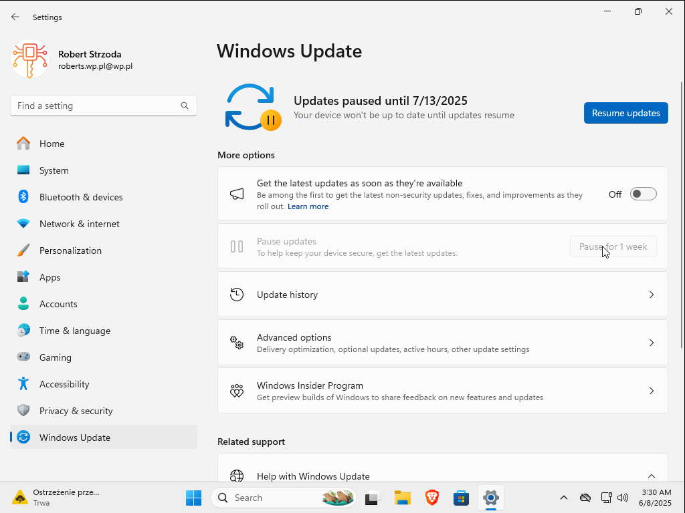
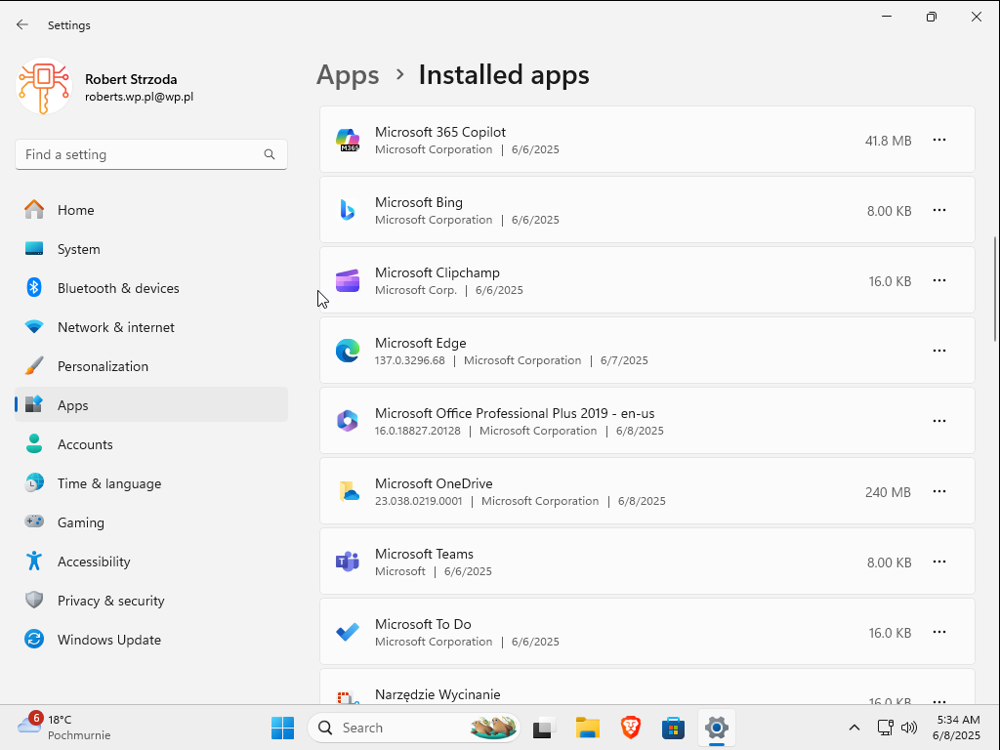
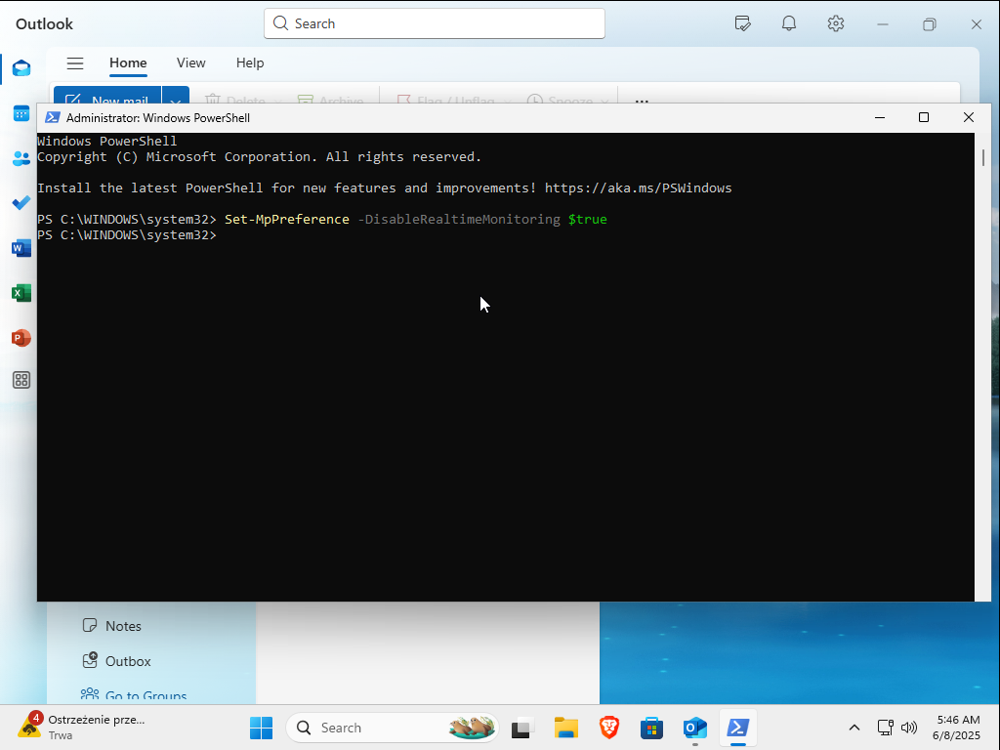

# Diving deeper into SIEM
*This experiment was peformed by me on 8.06.2025*

Challenges of the experiment:
- Understand detection rules
- Creating own Sigma rules
- Dive into CVE-2023-36884
- Figure out how to prevent it

Virtual Machines:
- Ubuntu 22.04.05 LTS VM
- Microsoft Windows 11 x64 VM
- Kali Linux VM

## 1. CVE-2023-36884
It's a Remote Code Execution (RCE) vulnerability in Microsoft Office/Windows HTML (MSHTML) that allows an attacker to remotely execute code by opening a malicious Office document (e.g. Word) embedded in a specially crafted link (e.g. .url, .lnk or HTML). It does not require macros. It occured in Office and Outlook versions like 2013 / 2016 / 2019 / 2021 / 365. To simulate it I had to disable Windows Update to prevent it from forcing me to move on safe versions. In this investigation I will rely on Office 2019 Professional Plus and <a href="https://github.com/jakabakos/CVE-2023-36884-MS-Office-HTML-RCE">RCE Script</a> from jakabakos GitHub. I created e-mail address purpletesting1@outlook.com just to have a fresh mailbox set up. 

In case Microsoft patched this vulnerability I had to disable Windows Defender, to bypass recognition of attack type. I made sure if I am running proper version of application.

From this point everything was ready to go. No additional config is required for log generation.

